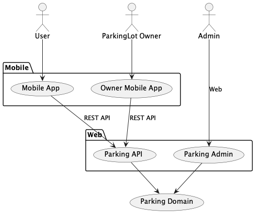

Parking in Davao City
======================

Supply demand matching system for parking lots in Davao City from Mobile.

# Vocabulary

* User: a person who uses the system
* ParkingLot: a parking lot
* ParkingRate: the rate of parking fee
* Vehicle: a vehicle, such as a car, truck, or motorcycle
* PointOfInterest(POI): a point of interest, such as a mall, restaurant, airport, hospital, or school etc
* ParkingTransaction: a transaction of parking
* VehicleMovingRequest: a request to move a vehicle

# Features

* User can view the list of parking lots
* User can register a vehicle
* User can book a parking lot
* User can make a car moving request

# Use Cases

* User uses mobile app to view the list of parking lots
* Parking lot owner uses app to register a parking lot
* Admin uses browser to manage system.

## QR Code Design

#### QR Code for Vehicle

* Vehicle UUID
* Register UUID
* Plate Number

#### QR Code for Parking Lot

* Parking Lot UUID
* Owner UUID

# Tech Stack

* Java 17
* Kotlin 1.8.20
* Spring Boot 3.0
* Spring Data JPA
* Maven 3.9
* PostgreSQL 15
* Kotlin Multiplatform Mobile: https://kotlinlang.org/lp/mobile/

### Mobile Apps

Kotlin Multiplatform Mobile

### Backend

Spring Boot 3.0 with REST API

### FrontEnd

* Admin Console: ReactJS
* Web Site: Astro
         
# Car Moving Service
 
Call LTO API to get car and owner information, then send SMS to the owner.

* Plate number of the vehicle
* Car Make and model
* Manufacturing year
* Car color
* Car owner name and phone

# References

* Kotlin: https://kotlinlang.org/
* Kotlin Multiplatform Mobile: https://kotlinlang.org/lp/mobile/
* LTO Plate Number Check: https://ltoportal.ph/plate-number-verification-check/
